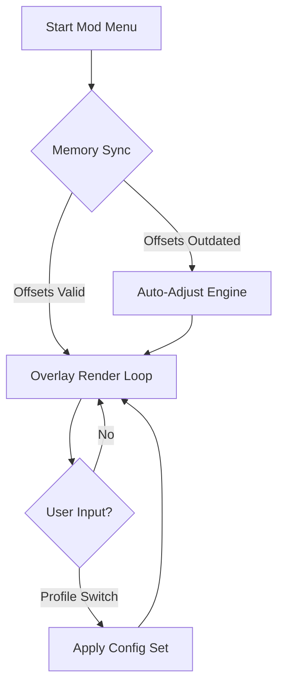

## 🧭 Overview

This tool operates as a customizable enhancement suite, offering dynamic overlays, tracking modules, and responsive controls that harmonize with your natural pace. Rather than overwhelming the screen, it quietly sketches meaning around you—item glints, movement vectors, distance rings—letting you breathe easier in the wild fog of DayZ.

After the overview, you’ll find practical configuration steps, compatibility details, a flowing Mermaid diagram of its event loop, and a living FAQ drawn from countless survivor tales.

---


---

## 🎯 Features

A symphony of modules—each responsive, each tuned to purpose:

* **Wall Vision Overlay**
  Soft outlines bloom around players, vehicles, and infected. Not a shouting beacon, but a murmured premonition.

* **Item Tracker with Filters**
  Create color-coded priorities: medical (🩹), food, ammo, high-tier loot. Adjust glow intensity to match your mood or situation.

* **Movement Prediction Engine**
  Estimates enemy pathing in tight encounters, displaying subtle arrows that evolve as targets pivot or sprint.

* **Terrain Awareness Grid**
  Highlights ridgelines, climbable structures, and cover points—your atlas of refuge.

* **Hot-Swap Presets**
  Switch between “Stealth,” “Looting,” and “Combat” profiles with a flick of a custom keybind.

[!IMPORTANT]
Toggling too many visuals simultaneously may dim clarity. Curate lightly—let the screen breathe.

---

## 🖥 Compatibility

| Component         | Support                       | Notes                     |
| ----------------- | ----------------------------- | ------------------------- |
| **OS**            | Windows 10, Windows 11        | 100% stable builds        |
| **Game Version**  | Latest DayZ Standalone        | Auto-offset update layer  |
| **Hardware**      | CPU w/AVX, any modern GPU     | overlay draws efficiently |
| **Accessibility** | Color-blind palettes included | customizable hues         |

---

## ⚡ Setup & Configuration

Seasoned wanderer or fresh castaway, the installation is swift:

1. **Download the launcher** from the badge above.
2. Extract into a clean directory (avoid cloud-sync folders).
3. Run as administrator to initialize memory mapping.
4. Set your first profile—try:

   ```ini
   [combat]
   player_fov = 120
   loot_distance = 260
   outline_thickness = 1.4
   item_priority = ammo,medical,rare
   ```
5. Use the in-game overlay menu (`F6` default) to tune live.

[!NOTE]
Using low GPU overhead modes may improve frame pacing on older setups.

---

## 🌿 Mermaid Diagram – Runtime Flow

A gentle map of how the software breathes with your game:



---

## 🔧 Additional Capabilities

* Smart distance fading for cleaner visuals at long range.
* Independent loot-rarity layers for nighttime scavenging.
* Ultra-quiet performance mode for potato hardware.
* Comprehensive hotkeys:

  * `ALT + M` — quick mute overlays
  * `CTRL + 2` — enable danger silhouettes
  * `SHIFT + Q` — profile swap ring

---

## ❓ FAQ — Gathered by Lanternlight

**Q: Does this affect server-side files?**
A: No, it remains a client-layer visualization suite with read-only memory operations.

**Q: Can I create my own profiles?**
A: Yes—unlimited, stored as human-readable `.cfg` files.

**Q: Will updates break the overlay?**
A: The self-adjust engine adapts to minor patches. Major updates may require refreshing the build.

**Q: Does it lower FPS?**
A: Only marginally in dense cities; the performance mode softens this further.

**Q: Is there community support?**
A: A vibrant group of tinkerers shares palettes and presets; links appear inside the launcher.

---

## 🌙 Final Thoughts

In the twilight hush between barn shadows and distant groans, this **DayZ Mod Menu** becomes both guide and companion—quiet, deliberate, alive with possibility. Tune it gently, shape it to your story, and let the fog part just a little sooner for you than for others.

